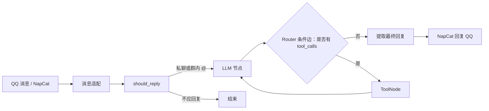

# QQ LangGraph Agent Bot — 设计归档

## MVP 边界

第一版只完成以下能力：

- QQ 文本私聊接收与回复。
- QQ 群聊仅在明确 @ 机器人时触发。
- 普通聊天、计算器和本地笔记查询。
- 基于 SQLite 的短期聊天状态。
- 明确展示 LangGraph State、回复判断、模型节点、条件路由和 ToolNode。

第一版不做长期记忆、RAG / 向量数据库、群内全量消息上下文、自动插话、图片或语音、网页管理后台、Redis、PostgreSQL、Docker 或微服务。

## 消息工作流

- `should_reply` 是确定性判断：私聊回复；群聊必须 @ 机器人；不做“自动参与群聊”。
- LLM 节点负责普通回答，并在需要时返回 Tool Calling 请求。
- Router 是 LangGraph 的条件边：根据最后一条模型消息是否带有 `tool_calls`，进入 ToolNode 或结束。
- ToolNode 执行工具后，将工具结果作为消息返回给 LLM 生成最终回复。

## Session 与状态

| 场景 | LangGraph `thread_id` | 隔离目的 |
|------|-----------------------|----------|
| 私聊 | `private:{user_id}` | 同一 QQ 用户在私聊中保持自己的短期上下文。 |
| 群聊 | `group:{group_id}:user:{user_id}` | 同一用户在不同群、不同用户在同一群均不共享历史。 |

短期聊天消息由 LangGraph SQLite checkpointer 保存。模型每次只读取近期消息窗口，避免上下文和调用成本无限增长。群内共享上下文属于后续进阶能力，不在 MVP 中实现。

## 接口归档（待工程阶段联调确认）

| 方向 | 方法 / 路径 | 用途 | 状态 |
|------|-------------|------|------|
| 入站 | WebSocket `/onebot/v11/ws` | NapCat 以反向 WebSocket 向应用推送 OneBot 消息事件。 | 已实现 (FastAPI)。 |
| 出站 | `POST {NAPCAT_API_BASE}/send_private_msg` | 发送 QQ 私聊文本。 | 已实现 (httpx)。 |
| 出站 | `POST {NAPCAT_API_BASE}/send_group_msg` | 发送 QQ 群聊文本。 | 已实现 (httpx)。 |

入站只处理 OneBot 的 `private` 与 `group` 文本消息；适配层提取 `message_id`、`user_id`、`group_id`、文本内容和是否 @ 机器人。机器人自身消息及其他事件类型直接忽略。

## 数据归档

| 数据对象 | 字段 / 归属 | 职责 |
|----------|-------------|------|
| `notes` | `id`、`title`、`content`、`created_at` | 本地笔记查询 Tool 的只读数据源；查询最多返回少量匹配项。 |
| LangGraph checkpointer | 由 `AsyncSqliteSaver` 管理的 SQLite 内部表 | 按 `thread_id` 保存图状态和短期消息；业务代码不直接依赖其表结构。 |

MVP 工具固定为：安全的四则运算计算器，以及按关键词查询 `notes` 的本地笔记工具。网页搜索不进入第一版，以避免新增第三方 API、网络失败和成本变量。

## 提示词与人设架构

| 模块 | 载体路径 | 职责与机制 |
|------|----------|------------|
| 人设定义 | `prompts/persona.md` | 独立 Markdown 文件，定义傲娇猫娘身份、口癖（“喵”/颜文字）与泛化工具调用契约（嘴嫌体正直）。 |
| 动态注入 | `src/qq_bot/graph/model.py` (`model_node`) | 内存中临时组装 `[SystemMessage, *state["messages"]]` 发送给模型，不污染 SQLite 会话持久化历史。带 `@lru_cache` 本地缓存。 |
