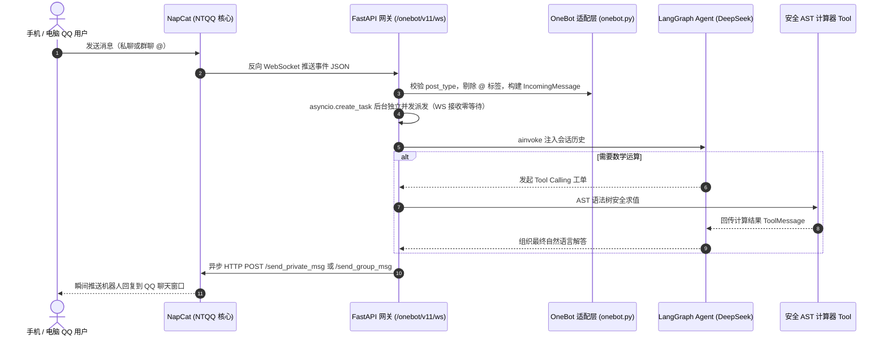

# QQ LangGraph Agent Bot

<div align="center">

> 基于 **LangGraph** + **OpenAI 兼容大模型（DeepSeek）** + **NapCat (OneBot 11)** 的现代化 QQ 智能 Agent 机器人。  
> 具备自主 **Tool Calling**、**安全 AST 算术求解**、**严格会话持久化隔离** 与 **全异步高并发网络网关**。

[](https://www.python.org/)
[](https://github.com/astral-sh/uv)
[](https://github.com/langchain-ai/langgraph)
[](https://onebot.adapters.nonebot.dev/)
[](LICENSE)

</div>

---

## 🌟 核心特性

- 🧠 **自主 Tool Calling（工具调用）**  
  基于 LangChain `bind_tools` 标准规范，大模型自主理解用户复杂的自然语言意图，按需发起工具调用工单，并将工具计算结果闭环总结为自然流畅的人类语言。
- 🛡️ **安全 AST 白名单计算器**  
  内置基于 Python 抽象语法树（AST）递归求值的算术工具，严密防御 `eval()` 带来的系统命令执行与代码注入漏洞，仅允许纯粹的四则与括号数学运算。
- 🔒 **严格会话隔离与 SQLite 持久化**  
  依托 LangGraph 的 `AsyncSqliteSaver` 检查点机制，实现多轮对话状态持久化：
  - **私聊**：按用户独立隔离 (`private:{user_id}`)；
  - **群聊**：按群与用户联合隔离 (`group:{group_id}:user:{user_id}`)，杜绝不同群或不同用户之间的数据串台与隐私泄露。
- ⚡ **全异步非阻塞网关架构**  
  采用 **FastAPI + uvicorn** 构建反向 WebSocket 服务端，收到 QQ 事件后通过 `asyncio.create_task` 零等待派发独立并发任务，杜绝大模型耗时推理卡死 WebSocket 连接与心跳保活。
- 🤖 **真实 QQ 生产网络无缝对接**  
  支持连接 **NapCat (OneBot 11)** 协议端，内置智能回复过滤策略（私聊必回、群聊未 @ 静默忽略、群聊 @ 自动唤醒并清洗标签）。

---

## 🏗️ 系统数据流架构



---

## 📂 项目结构

```text
qq-bot/
├── src/qq_bot/
│   ├── adapters/          # 协议适配层（OneBot 11 消息清洗、@提取与 HTTP 出站）
│   │   └── onebot.py
│   ├── domain/            # 领域模型定义（标准化 IncomingMessage DTO）
│   │   └── message.py
│   ├── graph/             # LangGraph 核心图拓扑
│   │   ├── checkpoint.py  # SQLite 异步持久化生命周期管理
│   │   ├── model.py       # 真实 OpenAI 兼容大模型客户端与工具绑定
│   │   ├── router.py      # 条件边路由逻辑（判断是否触发 ToolNode）
│   │   ├── state.py       # AgentState 定义与 add_messages Reducer
│   │   └── workflow.py    # 图编排与编译
│   ├── services/          # 业务逻辑层（回复策略过滤、Session Thread 构造）
│   │   ├── agent_service.py
│   │   ├── reply_policy.py
│   │   └── session.py
│   ├── tools/             # 工具层（基于 AST 白名单的安全四则运算）
│   │   └── calculator.py
│   ├── config.py          # 全局配置管理（单例只读环境变量解析）
│   ├── server.py          # FastAPI 网关服务、Lifespan 托管与 WebSocket 端点
│   └── __init__.py        # 离线 6 大场景全功能模拟运行入口
├── pyproject.toml         # uv 项目构建配置与脚本注册
├── .env.example           # 环境变量安全脱敏配置模板
├── CONTEXT.md             # 项目上下文与当前开发状态记录
├── DESIGN.md              # 接口路由与数据归档设计文档
└── README.md              # 项目主文档
```

---

## 🚀 快速上手指南

### 1. 环境准备与依赖安装

本项目使用现代化的 Python 包管理器 [uv](https://github.com/astral-sh/uv)。

```powershell
# 克隆本项目
git clone <your-repo-url>
cd qq-bot

# 一键创建虚拟环境并同步所有依赖
uv sync
```

### 2. 配置环境变量

从模板复制一份 `.env` 文件并填入你的大模型凭据与配置：

```powershell
Copy-Item .env.example .env
```

在 `.env` 中填写你的配置：
```env
# 大模型 API 配置（以 DeepSeek 官方为例）
OPENAI_API_KEY=sk-xxxxxxxxxxxxxxxxxxxxxxxxxxxxxxxx
OPENAI_BASE_URL=https://api.deepseek.com
OPENAI_MODEL_NAME=deepseek-v4-flash

# NapCat / OneBot 11 配置
NAPCAT_HTTP_URL=http://127.0.0.1:3000
BOT_QQ=你的机器人QQ号
SERVER_HOST=127.0.0.1
SERVER_PORT=8080
```

---

### 3. 运行离线模拟测试（无需 QQ 即可完整自验）

工程内置了 6 大离线验收场景（闲聊、未 @ 群聊拦截、应用题计算 Tool Calling、多轮记忆写入、多轮记忆召回、跨用户隐私隔离）：

```powershell
uv run qq-bot
```

---

### 4. 接入 NapCat 进行真机 QQ 实战

1. 启动 NapCat 并打开 WebUI（默认 `http://127.0.0.1:6099/webui`）；
2. 进入 **网络配置**：
   - **HTTP 服务**：启用，端口设为 `3000`，Host 为 `127.0.0.1`，Token 保持为空；
   - **Websocket 客户端**：添加一条反向 WebSocket，地址填 `ws://127.0.0.1:8080/onebot/v11/ws`，Token 保持为空；
3. 启动本项目的网关服务：
   ```powershell
   uv run qq-bot-server
   ```
4. 终端提示 `[OneBot] NapCat 反向 WebSocket 客户端已成功连接` 后，用手机 QQ 给机器人账号发消息，即可实时互动！

---

## 📄 开源许可证

本项目基于 [MIT 许可证](LICENSE) 开源发布。
